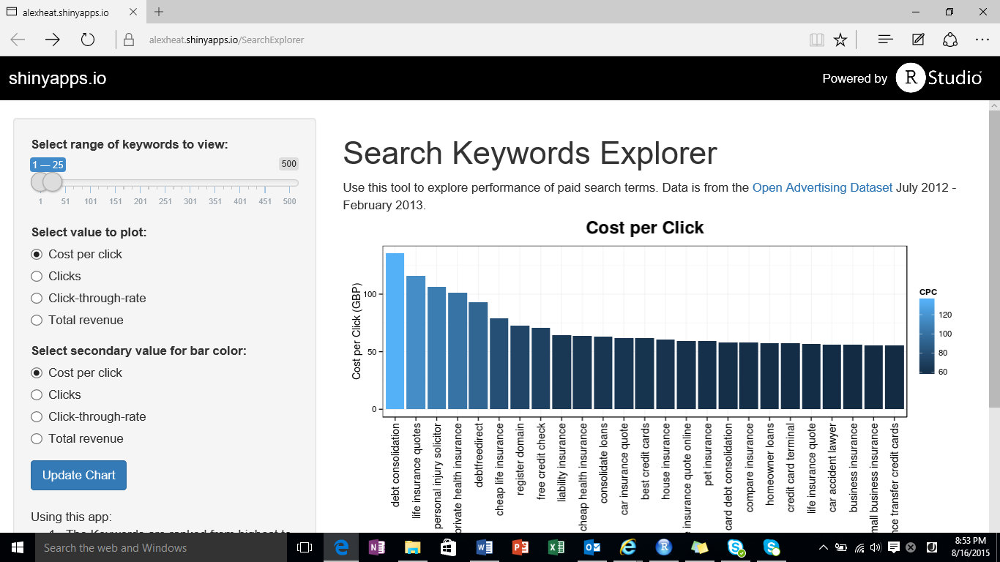

Shiny Search Word Explorer
========================================================
author: Alex Heaton
date: August 2015

Interactive reporting application built in R and Shiny.
<https://alexheat.shinyapps.io/SearchExplorer>

For Final Project of Developing Data Products class as part of Data Science Specialization from John Hopkins University. 

About This Application 
========================================================

Interactive dashborad that a company that sells or buys search could use to rank search ads based on the following criteria: 

- Cost per click (CPC)
- Click-through rate (CTR)
- Toal clicks
- Total revenue/costs (CPC x Clicks)

Data is from the [Open Advertising Dataset](https://code.google.com/p/open-advertising-dataset/) July 2012 - February 2013. 

Sample Data (keywords.csv)
========================================================

<!-- html table generated in R 3.2.1 by xtable 1.7-4 package -->
<!-- Mon Aug 17 05:14:28 2015 -->
<table border=1>
<tr> <th> Keyword </th> <th> Clicks </th> <th> CPC </th> <th> CTR </th>  </tr>
  <tr> <td> 0 apr credit card </td> <td align="right"> 885.63 </td> <td align="right"> 6.60 </td> <td align="right"> 3.49 </td> </tr>
  <tr> <td> 0 apr credit cards </td> <td align="right"> 1651.68 </td> <td align="right"> 15.62 </td> <td align="right"> 3.16 </td> </tr>
  <tr> <td> 0 credit card </td> <td align="right"> 10350.97 </td> <td align="right"> 22.06 </td> <td align="right"> 3.48 </td> </tr>
  <tr> <td> 0 credit cards </td> <td align="right"> 3178.44 </td> <td align="right"> 42.16 </td> <td align="right"> 2.98 </td> </tr>
  <tr> <td> 0 interest credit card </td> <td align="right"> 904.88 </td> <td align="right"> 43.29 </td> <td align="right"> 2.93 </td> </tr>
  <tr> <td> 0 interest credit cards </td> <td align="right"> 1712.29 </td> <td align="right"> 36.56 </td> <td align="right"> 2.84 </td> </tr>
  <tr> <td> 100 home equity loan </td> <td align="right"> 0.00 </td> <td align="right"> 0.00 </td> <td align="right"> 0.00 </td> </tr>
  <tr> <td> 1031 exchange </td> <td align="right"> 1.98 </td> <td align="right"> 0.02 </td> <td align="right"> 0.07 </td> </tr>
  <tr> <td> 125 equity loan </td> <td align="right"> 0.00 </td> <td align="right"> 0.00 </td> <td align="right"> 0.00 </td> </tr>
  <tr> <td> 125 home equity loan </td> <td align="right"> 0.00 </td> <td align="right"> 0.00 </td> <td align="right"> 0.00 </td> </tr>
  <tr> <td> 125 refinance </td> <td align="right"> 0.00 </td> <td align="right"> 0.00 </td> <td align="right"> 0.00 </td> </tr>
  <tr> <td> 21 auto century insurance </td> <td align="right"> 0.00 </td> <td align="right"> 0.00 </td> <td align="right"> 0.00 </td> </tr>
   </table>

Screenshot of Application
========================================================

Try it at <https://alexheat.shinyapps.io/SearchExplorer>

Future Enhancements
========================================================
- Click keyword to drill-into details for that word. Such as trendline of historical performance of CPC, CTR, Clicks, and Revenue.
- Search for specific terms.
- Sort list alpabetically to find related terms.
- Find all related terms. For example select "stock trading" and show all terms that include the words "stock" or "trading" to find the performance of related terms.
